# MANUAL DE USUARIO

## Libreria Don Héctor

---

## Índice

- [MANUAL DE USUARIO](#manual-de-usuario)
  - [Libreria Don Héctor](#libreria-don-héctor)
  - [Índice](#índice)
  - [Login](#login)
  - 
  - [Registro](#registro)
  - 
  - [Modulo Cliente](#modulo-cliente)
  - 
  - [Modulo Empleado](#modulo-empleado)
  - 
  - [Modulo Supervisor](#modulo-supervisor)
  - 
  - [Modulo Gerente](#modulo-gerente)
    - [Gestion de Supervisores](#gestion-de-supervisores)

---

## Login

- Se inicia sesion segun las credenciales de los usuarios
  - Se dirige al dashboard de cliente si es un cliente
  - Se dirige al dashboard de empleados si es un empleado.
  - Se dirige al dashboard de supervisor si es un supervisor.
  - Se dirige al dashboard de gerente si es un gerente.
    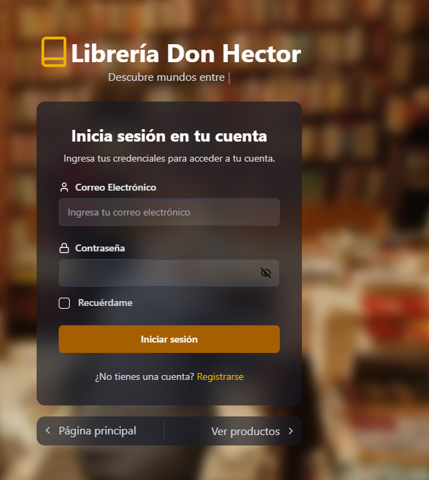

---

## Registro

- Se llena la informacion requerida para nuevos usuarios
  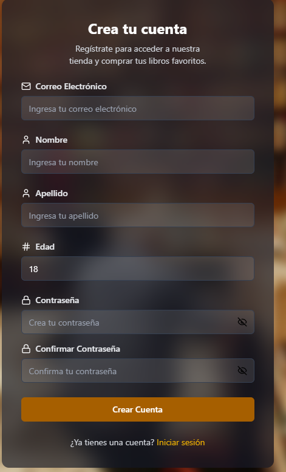

---

---

## Modulo Cliente

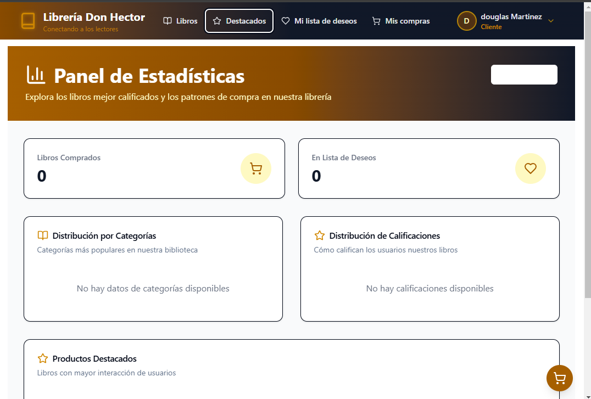
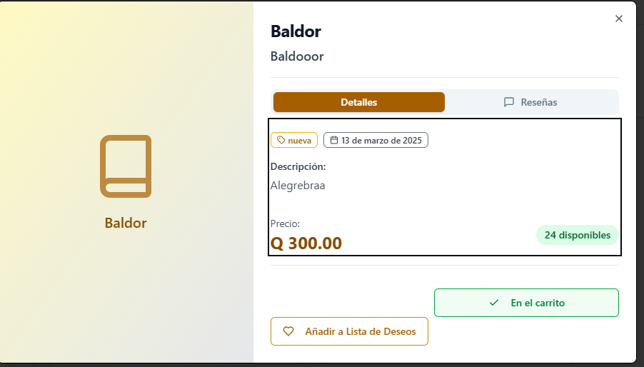
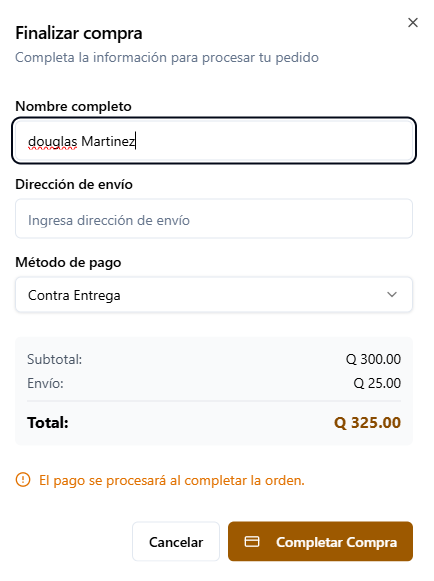
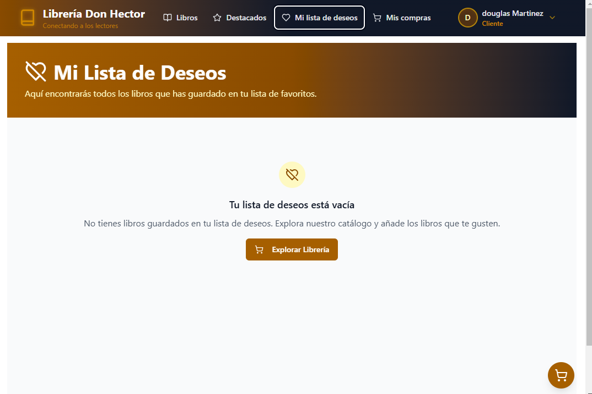

#### Creación de tickets

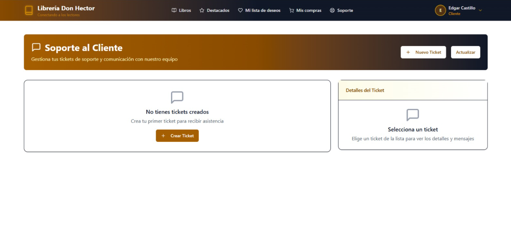

#### Formulario de datos para el ticket

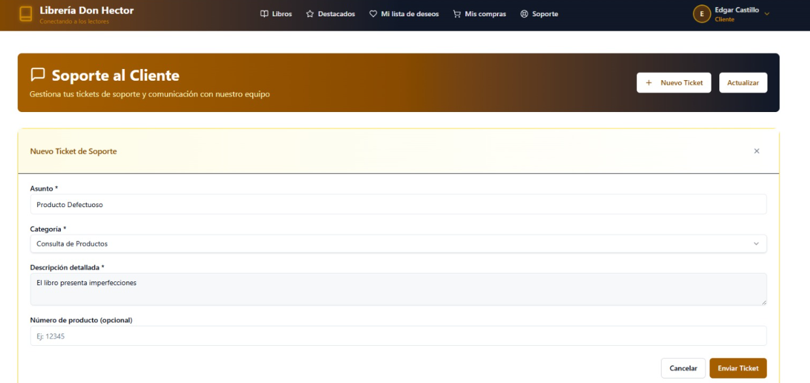

#### Vista del ticket creado

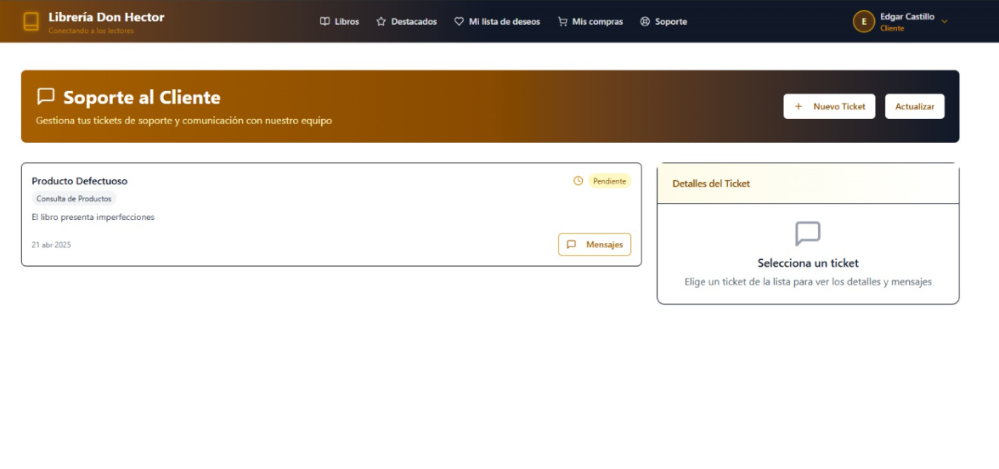

#### Al darle clic el Boton "Mensaje"  aparece la conversacion del ticket seleccionado

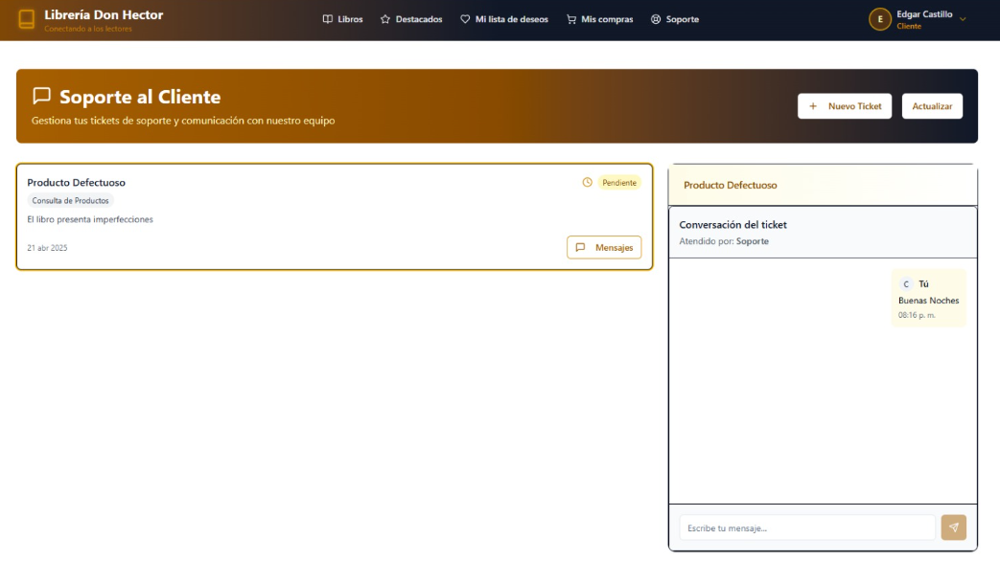

---

## Modulo Empleado

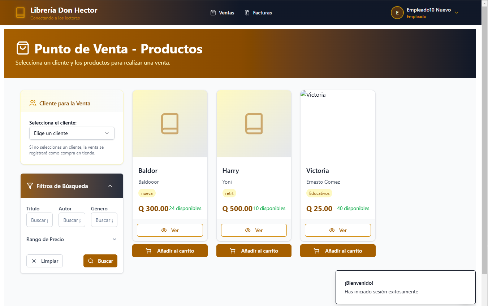

#### Vista de tickets

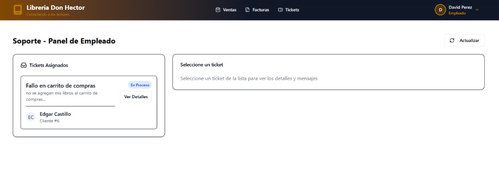

#### Al seleccionar Detalles se muestra los mensajes intercambiados con el cliente

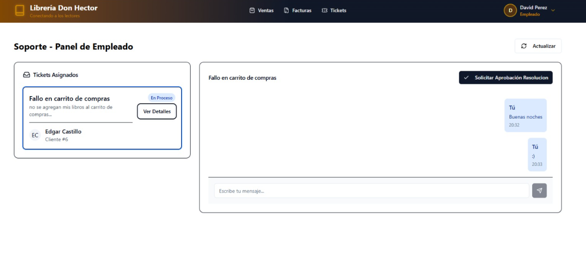

#### Al datle clic al boton Solicitar Aprobacion se cambia el estado del ticket a Aprobacion y no se permite intercambiar mensajes

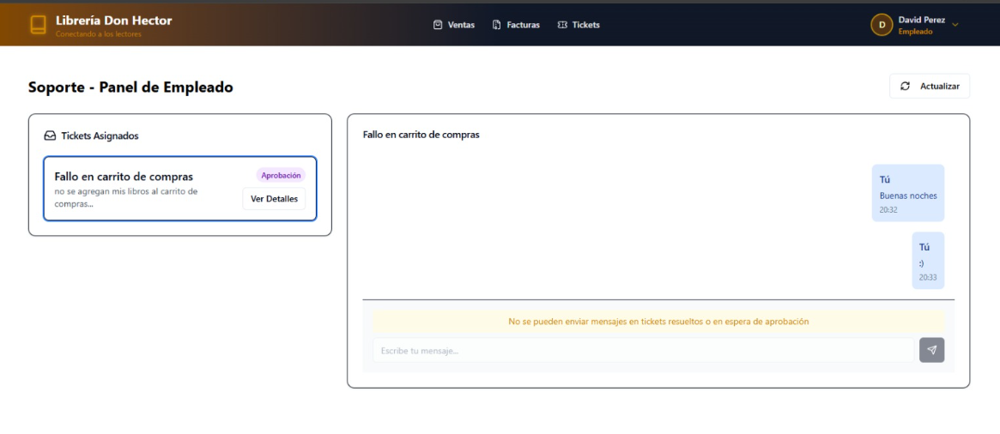

---

## Modulo Supervisor

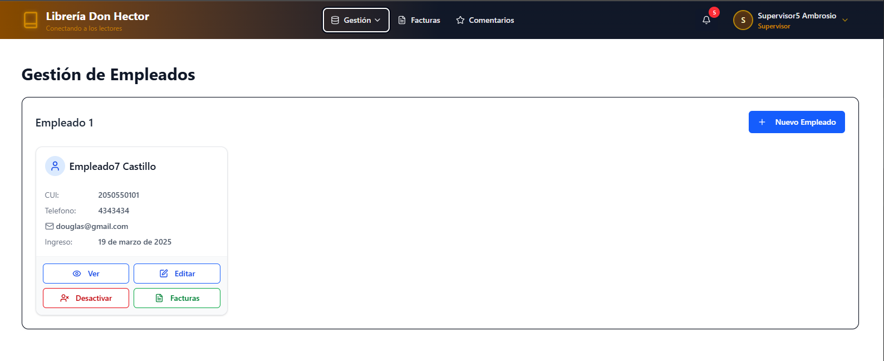
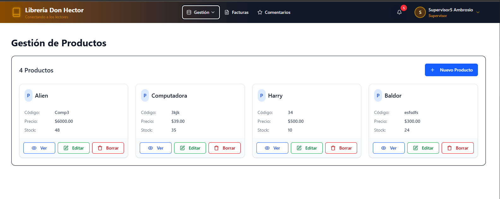
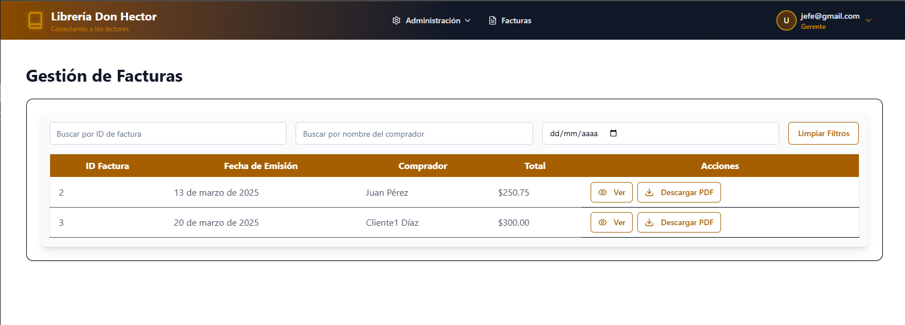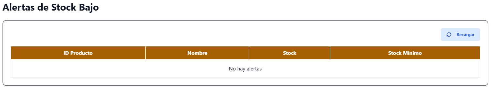

#### Tickets pendientes: La lista de los tickets para asignarle a un empleado y los tickets en la lista de aprobacio se muestra la lista de tickets puedan ser Resueltos y tickets en la lista de proceso lista los tickets que ya estan asignados a un empleado

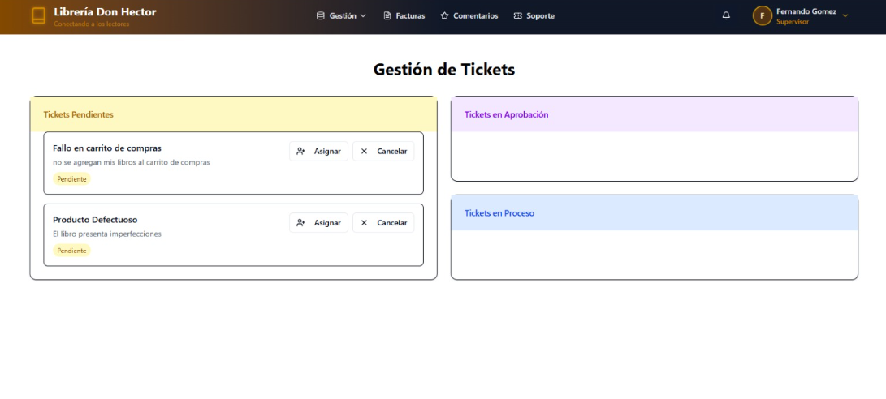

#### Al seleccionar el Boton Asignar se muestra los empleados disponiblesotra cosa

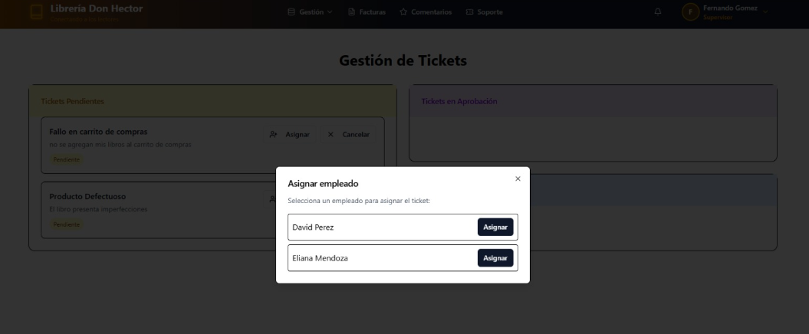

#### Al seleccionar un empleado se cambia de estado el ticket a En Procesootra cosa

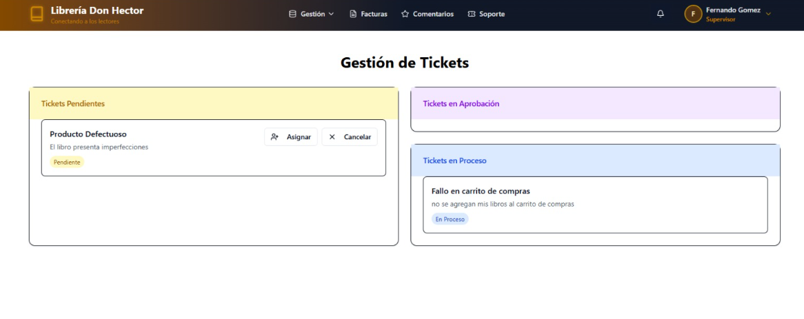

---

## Modulo Gerente

### Gestion de Supervisores

- Tablablero de Supervisores Registrados: Se muestra en este panel a todos los supervisores que se han registrado, asi mismo las opciones de "Administracion" y "Factura".
  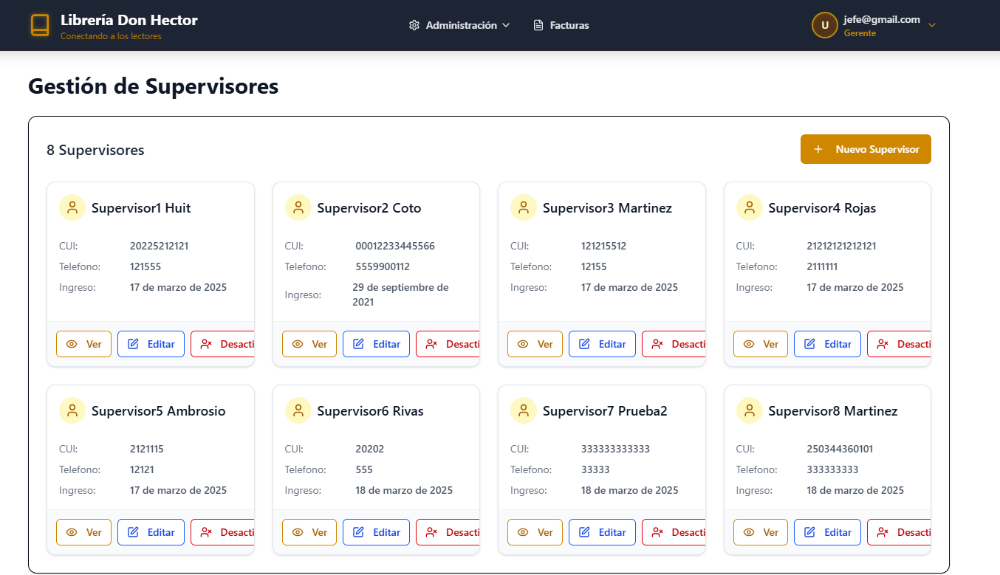
- Agregar Nuevo Supervisor: Al seleccionar el Boton "Nuevo Supervisor" se debe desplegara un formulario con la infomacion requerida para crear un nuevo supervisor.

  - Al completar los campos se almacenara el nuevo supervisor y se le notificara por correo la contraseña para ingresar a la plataforma.
  - Todos los cambos deben de ser llenados.
  - Al finaliza exitosamente el nuevo supervisor aparecera en el dashboard.
    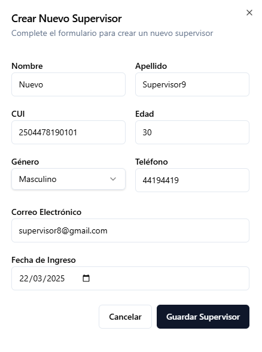.
- Modificar Supervisor: Al seleccionar el boton de "Editar" de la card de un supervisor de desplegara un form en el cual podra cambiar solamente el correo y el numero de telefono.

  - Para guardar los nuevos cambios de debe presionar "Actualizar Supervisor"
  - Si no se quiere realizar cambios se debe presionar "Cancelar"
    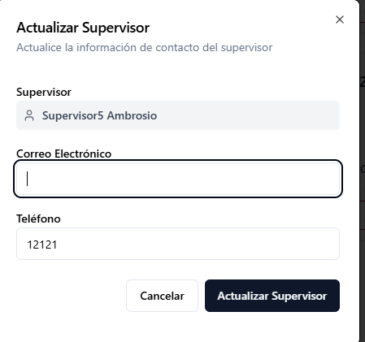.
- Desactivar Supervisor: Si se selecciona la opcion "Desactivar" de un supervisor se desplegara un form el cual solicitara el motivo.

  - Si se quiere proceder se presiona "Desactivar Supervisore"
  - Si se quiere cancelar se debe presionar "Cancelar"

.
