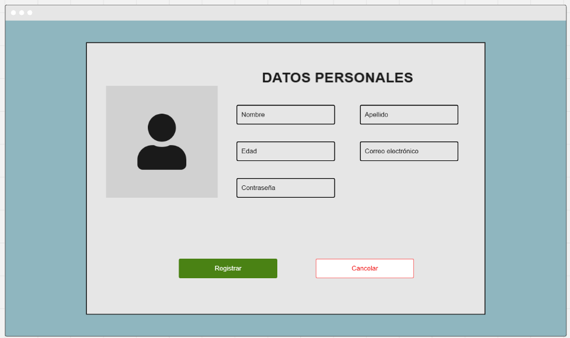

### UNIVERSIDAD SAN CARLOS DE GUATEMALA

### FACULTAD DE INGENIERIA

### ESCUELA DE CIENCIAS Y SISTEMAS

### CURSO: ANÁLISIS Y DISEÑO DE SISTEMAS 2

### SECCIÓN: B

  

<h1>Proyecto Fase 3</h1>

<h3>Integrantes</h3>

|              NOMBRE              |  CARNET  |
| :-------------------------------: | :-------: |
|    Aldo Saúl Vásquez Moreira    | 202109754 |
|    Douglas Josue Martinez Huit    | 201708975 |
|   María José Tebalan Sanchez   | 202100265 |
| José Eduardo Galdámez González | 202109732 |
|  Mynor Francisco Morán García  | 201603232 |

---

---

# [Video CI/CD](https://drive.google.com/file/d/10rrlQ2EnsIGqUibc4JIfhTpaGZGenulQ/view?usp=drive_link)

# Documentación de Sprint

### Daily Standup

| INTEGRANTES | DÍA 1 - LUNES 14 DE ABRIL                                                                                                                                                    | DÍA 2 - MARTES 15 DE ABRIL                                                                                                                                     | DÍA 3 - MIÉRCOLES 16 DE ABRIL                                                                                                                                                         | DÍA 4 - JUEVES 17 DE ABRIL                                                                                                                                                                         |
| ----------- | ----------------------------------------------------------------------------------------------------------------------------------------------------------------------------- | --------------------------------------------------------------------------------------------------------------------------------------------------------------- | --------------------------------------------------------------------------------------------------------------------------------------------------------------------------------------- | --------------------------------------------------------------------------------------------------------------------------------------------------------------------------------------------------- |
| **Jose**    | **Hoy:** Revisé y entendí los nuevos requerimientos de la fase 3.   **Ayer:** Empezaré la migración del repositorio.   **Problemas:** —                            | **Hoy:** Investigaré CI/CD en GitLab.   **Ayer:** Migré el repositorio de GitHub a GitLab.   **Problemas:** —                                          | **Hoy:** Actualicé y estandaricé el repo de GitLab para trabajar en equipo.   **Ayer:** Actualicé y probé la nueva versión estable para migrar el repo.   **Problemas:** —  | **Hoy:** Migré la base de datos de PostgreSQL del contenedor local que teníamos a Cloud SQL de GCP.   **Ayer:** Terminé de probar el software actual con sus builds.   **Problemas:** —   |
| **Aldo**    | **Hoy:** Crearé la cuenta en la nube.   **Ayer:** Determiné el proveedor más adecuado de servicios en la nube.   **Problemas:** —                                   | **Hoy:** Analizaré los servicios más adecuados para levantar la infraestructura en la nube.   **Ayer:** Creé la cuenta en la nube.   **Problemas:** — | **Hoy:** Levantaré los servicios elegidos para la infraestructura en la nube.   **Ayer:** Analicé los servicios adecuados para levantar la infraestructura.   **Problemas:** — | **Hoy:** Configuraré y desplegaré los servicios y bases de datos en GCP para migrar la base de datos local.   **Ayer:** Levanté los servicios para la infraestructura.   **Problemas:** — |
| **Douglas** | **Hoy:** Trabajaré correcciones pequeñas del módulo Supervisor.   **Ayer:** Analicé y detecté errores en la fase anterior.   **Problemas:** —                     | **Hoy:** Maquetaré el diseño de la vista Soporte Usuario.   **Ayer:** Trabajé correcciones pequeñas del módulo Supervisor.   **Problemas:** —       | **Hoy:** Trabajaré en la vista de creación de tickets del usuario.   **Ayer:** Maqueté el diseño de la vista Soporte Usuario.   **Problemas:** —                             | **Hoy:** Trabajaré en la vista de mensajes de tickets.   **Ayer:** Trabajé en la vista de creación de tickets.   **Problemas:** —                                                         |
| **Majo**    | **Hoy:** Trabajaré los cambios correspondientes del ER.   **Ayer:** Se inició la actualización del ER.   **Problemas:** —                                           | **Hoy:** Se analizaron los nuevos requerimientos funcionales.   **Ayer:** Trabajé los cambios correspondientes del ER.   **Problemas:** —               | **Hoy:** Trabajaré en la actualización del manual de usuario.   **Ayer:** Se analizaron los nuevos requerimientos funcionales.   **Problemas:** —                              | **Hoy:** Se empieza a documentar los primeros sprint.   **Ayer:** Trabajé en la actualización del manual.   **Problemas:** —                                                               |
| **Mynor**   | **Hoy:** Trabajaré el endpoint de creación y actualización de ticket.   **Ayer:** Realicé pruebas de cómo fue el release anterior del backend.   **Problemas:** — | **Hoy:** Trabajaré el endpoint de asignar ticket.   **Ayer:** Trabajé el endpoint de creación y actualización.   **Problemas:** —                    | **Hoy:** Endpoint de mensajes de tickets.   **Ayer:** Trabajé el endpoint de asignar ticket.   **Problemas:** —                                                                 | **Hoy:** Trabajaré en la visualización de tickets por empleado.   **Ayer:** Endpoint de mensajes de tickets.   **Problemas:** —                                                            |

---

| INTEGRANTES | DÍA 5 - VIERNES 18 DE ABRIL                                                                                                                                                                                                                                                         | DÍA 6 - SÁBADO 19 DE ABRIL                                                                                                                                             | DÍA 7 - DOMINGO 20 DE ABRIL                                                                                                                                                    |
| ----------- | ------------------------------------------------------------------------------------------------------------------------------------------------------------------------------------------------------------------------------------------------------------------------------------ | ------------------------------------------------------------------------------------------------------------------------------------------------------------------------ | ------------------------------------------------------------------------------------------------------------------------------------------------------------------------------- |
| **Jose**    | **Hoy:** Empecé a trabajar los dockers únicos de cada lado para la conexión a la base de datos y despliegue correcto.   **Ayer:** Revisé el funcionamiento y migración de la base de datos para que funcionara correctamente.   **Problemas:** —                         | **Hoy:** Levanté toda la configuración de runners y pipelines para CI/CD.   **Ayer:** —   **Problemas:** Tengo listos los dockers para el despliegue con CI/CD. | **Hoy:** Terminé la receta y se terminó el CI/CD correctamente para su deploy constante.   **Ayer:** Trabajé inicialmente en la receta para CI/CD.   **Problemas:** — |
| **Aldo**    | **Hoy:** Configuré Cloud Run para el frontend y backend del sistema.   **Ayer:** Configuré el servicio de base de datos en GCP para migrar la base de datos local.   **Problemas:** Problemas con el puerto de escucha en Cloud Run. Fue necesario modificar los Dockerfile. | **Hoy:** Comenzaré a preparar los pipelines de CI/CD para el backend.   **Ayer:** Configuré Cloud Run para el backend.   **Problemas:** Haré pruebas de CI/CD.  | **Hoy:** Comencé a preparar los pipelines de CI/CD para el backend.   **Ayer:** —   **Problemas:** —                                                                   |
| **Douglas** | **Hoy:** Trabajaré en la vista de soporte empleado.   **Ayer:** Trabajé en la vista de mensajes de tickets.   **Problemas:** —                                                                                                                                              | **Hoy:** Agregué las vistas terminadas al manual de usuario.   **Ayer:** Trabajé en la vista de soporte empleado.   **Problemas:** —                            | **Hoy:** Agregué las vistas terminadas al manual de usuario.   **Ayer:** Completé la última vista y la agregué al manual.   **Problemas:** —                         |
| **Majo**    | **Hoy:** Se actualiza Trello y la documentación.   **Ayer:** Se empieza a documentar los primeros sprint.   **Problemas:** —                                                                                                                                                 | **Hoy:** Trabajaré cambios en el manual del usuario.   **Ayer:** —   **Problemas:** Se finaliza la documentación técnica.                                      | **Hoy:** Trabajaré cambios en el manual del usuario.   **Ayer:** —   **Problemas:** —                                                                                  |
| **Mynor**   | **Hoy:** Trabajaré la visualización de tickets por usuario.   **Ayer:** Trabajé la visualización de tickets por empleado.   **Problemas:** —                                                                                                                              | **Hoy:** Pruebas de backend unitarias.   **Ayer:** Revisión y corrección del endpoint de asignar ticket.   **Problemas:** —                                     | **Hoy:** Pruebas de backend unitarias.   **Ayer:** —   **Problemas:** —                                                                                                 |

## Sprint planning

## Sprint retrospective

| Pregunta                                                     | Sprint 1                                                                                                                                                                                                                                                                                                                                                     | Sprint 2                                                                                                                                                                                                                                                                                                         | Sprint 3                                                                                                                                                                                                                                                                                                                          |
| ------------------------------------------------------------ | ------------------------------------------------------------------------------------------------------------------------------------------------------------------------------------------------------------------------------------------------------------------------------------------------------------------------------------------------------------ | ---------------------------------------------------------------------------------------------------------------------------------------------------------------------------------------------------------------------------------------------------------------------------------------------------------------- | --------------------------------------------------------------------------------------------------------------------------------------------------------------------------------------------------------------------------------------------------------------------------------------------------------------------------------- |
| ¿Qué se hizo bien durante el Sprint?                       | **Jose:** Se estandarizó el proceso de tareas.   **Aldo:** Se definió claramente qué haría cada quien.   **Mynor:** Se definieron los endpoints a utilizar en el backend.   **Douglas:** Se dio buen inicio al diseño de vistas y flujo de tickets.   **Majo:** Se estructuró el esquema de documentación de requerimientos y ER inicial. | **Jose:** Se trabajó con rapidez los requerimientos.   **Aldo:** Hubo buena comunicación.   **Mynor:** Rapidez en los requerimientos.   **Douglas:** Avance estable en las vistas de usuario.   **Majo:** Se organizó la documentación de avances diarios y checklist de requisitos por módulo. | **Jose:** División de equipos y responsabilidades.   **Aldo:** Se terminaron todos los requerimientos.   **Mynor:** Terminación de requerimientos y funcionalidades.   **Douglas:** Implementación final de las vistas de tickets.   **Majo:** Registro de entregables por vista y sección en documentación.     |
| ¿Qué se hizo mal durante el Sprint?                        | **Jose:** Inició tarde por falta de comunicación.   **Aldo:** Se tuvo poco tiempo.   **Mynor:** Retraso en la planificación.   **Douglas:** Reutilización inadecuada de componentes.   **Majo:** Documentación atrasada por falta de visibilidad de tareas finalizadas.                                                                     | **Jose:** Corrección de errores tardíos de la anterior fase.   **Aldo:** Existieron atrasos.   **Mynor:** Poca comunicación en desarrollo.   **Douglas:** Desfase entre desarrollo y pruebas.   **Majo:** Algunos criterios no estaban bien definidos al momento de documentar procesos.          | **Jose:** No preguntar ciertas cosas antes de hacer commits.   **Aldo:** Existió holgura de tiempo.   **Mynor:** Mala ejecución e implementación de un requerimiento.   **Douglas:** No se consideraron casos de borde en validaciones.   **Majo:** Desorden en la documentación de entregas y evidencias.        |
| ¿Qué mejoras se deben implementar para el próximo sprint? | **Jose:** Avanzar sin estar en supervisión.   **Aldo:** Tomar iniciativa para avanzar más cosas.   **Mynor:** Mejor planeación en los endpoints.   **Douglas:** Validar funcionalidad visual antes de hacer merge.   **Majo:** Consolidar una estructura de documentación por componente y responsable.                                      | **Jose:** Mejorar tiempos de entrega.   **Aldo:** Mejorar distribución de tareas.   **Mynor:** Mejorar las pruebas de los endpoints.   **Douglas:** Validar el avance de backend antes de continuar vistas.   **Majo:** Agregar bitácora de cambios diarios a la documentación.                   | **Jose:** Mejorar comunicación entre commits y ramas.   **Aldo:** Mejorar distribución de tareas.   **Mynor:** Planificar las pruebas unitarias y de implementación.   **Douglas:** Realizar revisión cruzada de vistas antes de subir.   **Majo:** Asegurar documentación final al terminar cada requerimiento. |

---

| Pregunta                                                     | Sprint 4                                                                                                                                                                                                                                                                                                                                  |
| ------------------------------------------------------------ | ----------------------------------------------------------------------------------------------------------------------------------------------------------------------------------------------------------------------------------------------------------------------------------------------------------------------------------------- |
| ¿Qué se hizo bien durante el Sprint?                       | **Jose:** Rapidez en el despliegue en cloud del proyecto.   **Aldo:** Se definió rápidamente la infraestructura en la nube.   **Mynor:** Conclusión de requerimientos.   **Douglas:** Vistas de tickets y soporte finalizadas a tiempo.   **Majo:** Organización final de la documentación técnica y de usuario.        |
| ¿Qué se hizo mal durante el Sprint?                        | **Jose:** Errores de compilación que afectan el CI/CD.   **Aldo:** Poco tiempo para ver con más calma errores en el proceso de despliegue.   **Mynor:** Determinar casos de prueba.   **Douglas:** Problemas menores con el responsive de vistas.   **Majo:** Dificultad para documentar partes no comunicadas del código. |
| ¿Qué mejoras se deben implementar para el próximo sprint? | **Jose:** Empezar antes los proyectos.   **Aldo:** Considerar mejor el tiempo.   **Mynor:** Llevar un control de los escenarios de prueba.   **Douglas:** Consolidar feedback antes de cerrar módulos.   **Majo:** Sincronizar entregables técnicos con los commits funcionales.                                            |

### Imagen en donde se visualiza el tablero en la finalización del sprint.

## Core del Negocio

### Descripción

La Librería de Don Héctor es un negocio familiar establecido hace más de 25 años en una ciudad quetzal, que se especializa en la venta de artículos escolares y libros. El negocio está enfrentando desafíos de modernización y busca transformarse digitalmente para:

1. Optimizar la gestión de inventario, abandonando los métodos manuales actuales
2. Expandir su presencia al mercado digital de libros
3. Mejorar la eficiencia operativa general
4. Permitir el crecimiento mediante múltiples sucursales

El negocio opera bajo una estructura jerárquica clara con los siguientes roles principales:

- Gerente (Don Héctor)
- Supervisores (José y sus hermanos)
- Empleados (familiares y personal temporal)
- Usuarios (clientes de la plataforma digital)

# Casos de Uso - Plataforma "Librería de Don Héctor"

---

## Caso de Uso 01: Procesar Venta

- **ID:** CU-01
- **Módulo:** Ventas
- **Actor Principal:** Empleado
- **Precondiciones:**
  - El empleado debe haber iniciado sesión en el sistema.
  - Los productos deben estar registrados en el inventario.
- **Postcondiciones:**
  - La venta queda registrada en el sistema.
  - Se genera y almacena la factura.
  - Se actualiza el stock de los productos vendidos.
- **Escenario Principal:**
  1. El empleado accede al módulo de ventas.
  2. Selecciona los productos que el cliente desea comprar.
  3. Ingresa la cantidad de cada producto.
  4. El sistema calcula el total de la compra.
  5. Se genera la factura correspondiente.
  6. El empleado registra el pago del cliente.
  7. El sistema confirma la transacción y almacena los datos.
- **Escenario Alternativo:**
  - Si el stock de algún producto es insuficiente, el sistema muestra una alerta y sugiere alternativas.
  - Si el cliente decide cancelar la compra, el empleado puede salir del proceso sin guardar los cambios.
- **Requerimientos Especiales:**
  - Interfaz intuitiva para la selección de productos.
  - Validación en tiempo real del stock disponible.
- **Sistema:**
  - El sistema debe permitir la consulta del historial de ventas y facturas.

---

## Caso de Uso 02: Registrar Venta

- **ID:** CU-02
- **Módulo:** Ventas
- **Actor Principal:** Empleado
- **Precondiciones:**
  - El sistema debe estar operativo.
  - El empleado debe tener permisos para realizar ventas.
- **Postcondiciones:**
  - Se almacena el detalle de la venta en la base de datos.
- **Escenario Principal:**
  1. El empleado busca y selecciona los productos que el cliente quiere comprar.
  2. Ingresa las cantidades y verifica los precios.
  3. El sistema muestra el total de la compra.
  4. La información se guarda temporalmente para su confirmación.
- **Escenario Alternativo:**
  - Si el producto no está registrado, el sistema muestra una alerta.
- **Requerimientos Especiales:**
  - El sistema debe permitir búsqueda rápida por nombre o código de producto.
- **Sistema:**
  - La venta debe quedar registrada correctamente para ser procesada en el siguiente paso.

---

## Caso de Uso 03: Generar Factura

- **ID:** CU-03
- **Módulo:** Facturación
- **Actor Principal:** Empleado
- **Precondiciones:**
  - La venta debe haber sido registrada correctamente.
- **Postcondiciones:**
  - Se genera una factura con un ID único.
  - La factura se almacena en el sistema y se imprime o envía por correo.
- **Escenario Principal:**
  1. Tras registrar la venta, el sistema prepara la factura.
  2. Se asigna un número único a la factura.
  3. Se incluyen detalles como fecha, productos, precios y total.
  4. Se genera un PDF y se envía por correo o se imprime.
- **Escenario Alternativo:**
  - Si el correo del cliente no está registrado, el sistema permite ingresar un correo manualmente.
- **Requerimientos Especiales:**
  - La factura debe cumplir con normativas fiscales locales.
- **Sistema:**
  - La factura debe estar disponible para futuras consultas y auditorías.

---

## Caso de Uso 04: Registrar Pago

- **ID:** CU-04
- **Módulo:** Pagos
- **Actor Principal:** Empleado
- **Precondiciones:**
  - La venta debe haber sido registrada.
- **Postcondiciones:**
  - El pago queda registrado en el sistema.
  - La venta cambia a estado “pagada”.
- **Escenario Principal:**
  1. El empleado selecciona el método de pago (efectivo).
  2. Ingresa el monto recibido.
  3. El sistema confirma el pago y almacena la información.
- **Escenario Alternativo:**
  - Si el pago es insuficiente, el sistema muestra un mensaje de error.
- **Requerimientos Especiales:**
  - Validación del monto ingresado.
- **Sistema:**
  - Los pagos registrados deben ser consultables posteriormente.

---

## Caso de Uso 05: Consultar Información de Productos

- **ID:** CU-05
- **Módulo:** Inventario
- **Actor Principal:** Empleado
- **Precondiciones:**
  - El empleado debe haber iniciado sesión.
- **Postcondiciones:**
  - Se muestra la información del producto en pantalla.
- **Escenario Principal:**
  1. El empleado accede al módulo de inventario.
  2. Busca un producto por nombre o código.
  3. El sistema muestra los detalles del producto.
- **Escenario Alternativo:**
  - Si el producto no existe, el sistema muestra una alerta.
- **Requerimientos Especiales:**
  - Búsqueda optimizada por filtros.
- **Sistema:**
  - El sistema debe permitir la actualización de la información de productos.

---

## Caso de Uso 06: Ver Facturas Anteriores

- **ID:** CU-06
- **Módulo:** Facturación
- **Actor Principal:** Empleado
- **Precondiciones:**
  - El sistema debe contener registros de ventas previas.
- **Postcondiciones:**
  - Se muestra la información de facturación solicitada.
- **Escenario Principal:**
  1. El empleado accede al módulo de facturación.
  2. Filtra por fecha o número de factura.
  3. El sistema muestra los detalles de la factura seleccionada.
- **Escenario Alternativo:**
  - Si no se encuentra la factura, el sistema muestra un mensaje de error.
- **Requerimientos Especiales:**
  - Historial con filtros avanzados.
- **Sistema:**
  - Las facturas deben estar disponibles para consulta y auditoría.

## Caso de Uso 07: Gestionar Empleados

- **ID:** CU-07
- **Módulo:** Empleados
- **Actor Principal:** Supervisor
- **Precondiciones:**
  - El supervisor debe haber iniciado sesión en la plataforma.
  - El sistema debe estar operativo y contar con los permisos adecuados para gestionar empleados.
- **Postcondiciones:**
  - Se registra la acción realizada (agregar, modificar, eliminar o ver información de un empleado).
  - La información de los empleados queda actualizada en el sistema.
- **Escenario Principal:**
  1. El supervisor accede al módulo de gestión de empleados.
  2. Selecciona la acción deseada:
     - Agregar Empleado
     - Modificar Empleado
     - Eliminar Empleado
     - Ver Información de Empleado
  3. Se ejecuta la acción correspondiente mediante la interacción con el sistema.
- **Escenario Alternativo:**
  - Si se intenta modificar o eliminar un empleado inexistente, el sistema muestra un mensaje de error.
- **Requerimientos Especiales:**
  - El sistema debe enviar notificaciones automáticas (por ejemplo, correo de confirmación) al agregar un empleado.
- **Sistema:**
  - El sistema debe mantener un registro o log de todas las operaciones realizadas sobre empleados.
- **Relaciones Include:**
  - **Agregar Empleado**
  - **Modificar Empleado**
  - **Eliminar Empleado**
  - **Ver Información de Empleado**

---

### Sub-Casos de Uso para "Gestionar Empleados"

#### Caso de Uso 07.1: Agregar Empleado

- **ID:** CU-07.1
- **Módulo:** Empleados
- **Actor Principal:** Supervisor
- **Precondiciones:**
  - El supervisor debe haber iniciado sesión.
- **Postcondiciones:**
  - El nuevo empleado queda registrado en el sistema.
  - Se envía un correo de confirmación con las credenciales.
- **Escenario Principal:**
  1. El supervisor selecciona "Agregar Empleado".
  2. Ingresa la información requerida: nombre, apellido, CUI, teléfono, correo electrónico, edad, género, fecha de contratación y fotografía.
  3. El sistema registra al empleado y envía el correo de confirmación.
- **Escenario Alternativo:**
  - Si falta algún dato obligatorio, el sistema muestra una alerta.
- **Requerimientos Especiales:**
  - Validación de datos en tiempo real y encriptación de la contraseña generada.
- **Sistema:**
  - Actualiza la base de datos de empleados y genera un log de la acción.

---

#### Caso de Uso 07.2: Modificar Empleado

- **ID:** CU-07.2
- **Módulo:** Empleados
- **Actor Principal:** Supervisor
- **Precondiciones:**
  - El empleado a modificar debe existir en el sistema.
- **Postcondiciones:**
  - La información del empleado se actualiza correctamente en el sistema.
- **Escenario Principal:**
  1. El supervisor busca y selecciona al empleado a modificar.
  2. Actualiza la información de contacto (u otros datos permitidos).
  3. El sistema guarda los cambios y actualiza el registro del empleado.
- **Escenario Alternativo:**
  - Si el empleado no existe o la modificación falla, el sistema notifica el error.
- **Requerimientos Especiales:**
  - El sistema debe permitir la actualización parcial de la información sin afectar datos críticos.
- **Sistema:**
  - Se genera un log de modificación para auditoría.

---

#### Caso de Uso 07.3: Eliminar Empleado

- **ID:** CU-07.3
- **Módulo:** Empleados
- **Actor Principal:** Supervisor
- **Precondiciones:**
  - El empleado a eliminar debe existir en el sistema.
- **Postcondiciones:**
  - El empleado se marca como inactivo o se elimina de la lista activa, conservándose el registro en un log.
- **Escenario Principal:**
  1. El supervisor selecciona al empleado que desea eliminar.
  2. Ingresa la causa de la desvinculación.
  3. El sistema registra la eliminación y archiva el historial.
- **Escenario Alternativo:**
  - Si el empleado no puede ser eliminado por restricciones del sistema, se muestra un mensaje de error.
- **Requerimientos Especiales:**
  - Conservación de historial y registro de auditoría.
- **Sistema:**
  - Actualiza la base de datos y genera un log de eliminación.

---

#### Caso de Uso 07.4: Ver Información de Empleado

- **ID:** CU-07.4
- **Módulo:** Empleados
- **Actor Principal:** Supervisor
- **Precondiciones:**
  - El supervisor debe haber iniciado sesión y existir registros de empleados.
- **Postcondiciones:**
  - Se muestra la información detallada del empleado seleccionado.
- **Escenario Principal:**
  1. El supervisor accede al listado de empleados.
  2. Selecciona un empleado para ver sus datos completos.
  3. El sistema despliega la información del empleado.
- **Escenario Alternativo:**
  - Si no se encuentra el empleado, se muestra un mensaje de error.
- **Requerimientos Especiales:**
  - Interfaz clara para la visualización de datos.
- **Sistema:**
  - Permite la consulta y exportación de información para auditoría.

---

## Caso de Uso 08: Gestionar Inventario

- **ID:** CU-08
- **Módulo:** Inventario
- **Actor Principal:** Supervisor
- **Precondiciones:**
  - El supervisor debe haber iniciado sesión.
  - Debe existir información previa de productos en el sistema.
- **Postcondiciones:**
  - Se registra la acción realizada sobre el inventario (agregar, modificar, eliminar o ver productos).
  - La información del inventario queda actualizada.
- **Escenario Principal:**
  1. El supervisor accede al módulo de inventario.
  2. Selecciona la acción deseada:
     - Agregar Producto
     - Modificar Producto
     - Eliminar Producto
     - Ver Producto
  3. Se ejecuta la acción correspondiente y se actualiza la base de datos del inventario.
- **Escenario Alternativo:**
  - Si se intenta modificar o eliminar un producto inexistente, el sistema muestra un mensaje de error.
- **Requerimientos Especiales:**
  - Validación en tiempo real de la disponibilidad y datos de los productos.
- **Sistema:**
  - Mantiene un registro actualizado del inventario y genera logs de las operaciones.
- **Relaciones Include:**
  - **Agregar Producto**
  - **Modificar Producto**
  - **Eliminar Producto**
  - **Ver Producto**

---

### Sub-Casos de Uso para "Gestionar Inventario"

#### Caso de Uso 08.1: Agregar Producto

- **ID:** CU-08.1
- **Módulo:** Inventario
- **Actor Principal:** Supervisor
- **Precondiciones:**
  - El supervisor debe haber iniciado sesión.
- **Postcondiciones:**
  - El producto queda registrado en el inventario.
- **Escenario Principal:**
  1. El supervisor selecciona "Agregar Producto".
  2. Ingresa los datos del producto: nombre, descripción, código, categoría, precio de compra, precio de venta, cantidad en inventario y la imagen del producto.
  3. El sistema registra el producto y actualiza el inventario.
- **Escenario Alternativo:**
  - Si falta información o el código ya existe, el sistema muestra un mensaje de error.
- **Requerimientos Especiales:**
  - Validación de datos y formatos, manejo de imágenes.
- **Sistema:**
  - Actualiza la base de datos del inventario y genera un log de la acción.

---

#### Caso de Uso 08.2: Modificar Producto

- **ID:** CU-08.2
- **Módulo:** Inventario
- **Actor Principal:** Supervisor
- **Precondiciones:**
  - El producto a modificar debe existir en el inventario.
- **Postcondiciones:**
  - La información del producto se actualiza en el sistema.
- **Escenario Principal:**
  1. El supervisor busca y selecciona el producto a modificar.
  2. Actualiza la información pertinente (precio, descripción, stock, etc.).
  3. El sistema guarda los cambios y actualiza el registro del producto.
- **Escenario Alternativo:**
  - Si el producto no existe, el sistema muestra un mensaje de error.
- **Requerimientos Especiales:**
  - Permitir cambios parciales sin afectar otros atributos del producto.
- **Sistema:**
  - Actualiza la base de datos y genera un log de modificación.

---

#### Caso de Uso 08.3: Eliminar Producto

- **ID:** CU-S08.3
- **Módulo:** Inventario
- **Actor Principal:** Supervisor
- **Precondiciones:**
  - El producto a eliminar debe existir en el inventario.
- **Postcondiciones:**
  - El producto se marca como eliminado o se retira del inventario, conservándose el registro en el sistema.
- **Escenario Principal:**
  1. El supervisor selecciona el producto a eliminar.
  2. Confirma la eliminación del producto.
  3. El sistema actualiza el inventario y registra la acción en un log.
- **Escenario Alternativo:**
  - Si el producto no se puede eliminar por restricciones del sistema, se muestra un mensaje de error.
- **Requerimientos Especiales:**
  - Registro en log y posible opción de reversión en caso de error.
- **Sistema:**
  - Actualiza la base de datos del inventario.

---

#### Caso de Uso 08.4: Ver Producto

- **ID:** CU-08.4
- **Módulo:** Inventario
- **Actor Principal:** Supervisor
- **Precondiciones:**
  - El supervisor debe haber iniciado sesión y existir productos registrados.
- **Postcondiciones:**
  - Se muestra la información completa del producto seleccionado.
- **Escenario Principal:**
  1. El supervisor accede al listado de productos.
  2. Selecciona un producto para ver sus detalles.
  3. El sistema despliega la información detallada del producto.
- **Escenario Alternativo:**
  - Si el producto no existe, el sistema notifica al usuario.
- **Requerimientos Especiales:**
  - Interfaz intuitiva para la visualización de datos.
- **Sistema:**
  - Permite la consulta y, en algunos casos, la exportación de información para auditorías.

---

## Caso de Uso 09: Ver Facturas Emitidas

- **ID:** CU-09
- **Módulo:** Facturación
- **Actor Principal:** Supervisor
- **Precondiciones:**
  - El supervisor debe haber iniciado sesión.
  - Debe existir un historial de facturas emitidas en el sistema.
- **Postcondiciones:**
  - Se muestra el listado y detalle de facturas emitidas.
- **Escenario Principal:**
  1. El supervisor accede al módulo de facturación.
  2. Aplica filtros (por fecha, empleado, cliente, etc.).
  3. El sistema despliega las facturas que cumplen con los criterios.
  4. El supervisor selecciona una factura para ver los detalles completos.
- **Escenario Alternativo:**
  - Si no se encuentra ninguna factura, se muestra un mensaje de alerta.
- **Requerimientos Especiales:**
  - Filtros avanzados y capacidad de exportación de datos.
- **Sistema:**
  - Mantiene un registro actualizado y consultable de todas las facturas.

---

## Caso de Uso 10: Ver Opiniones y Comentarios

- **ID:** CU-10
- **Módulo:** Retroalimentación
- **Actor Principal:** Supervisor
- **Precondiciones:**
  - El supervisor debe haber iniciado sesión.
  - Deben existir opiniones y comentarios registrados en el sistema.
- **Postcondiciones:**
  - Se muestran las opiniones y comentarios asociados a los libros.
- **Escenario Principal:**
  1. El supervisor accede al módulo de retroalimentación.
  2. El sistema despliega una lista de opiniones y comentarios con su calificación, comentario y fecha de reseña.
  3. El supervisor puede filtrar o buscar opiniones según criterios (por ejemplo, libro o fecha).
- **Escenario Alternativo:**
  - Si no existen opiniones o comentarios, el sistema indica que no hay datos disponibles.
- **Requerimientos Especiales:**
  - Interfaz amigable que permita la fácil lectura y filtrado de los comentarios.
- **Sistema:**
  - Almacena las opiniones y comentarios de los clientes para análisis y toma de decisiones.

---

## Caso de Uso 11: Gestionar Libros

- **ID:** CU-11
- **Módulo:** Libros
- **Actor Principal:** Supervisor
- **Precondiciones:**
  - El supervisor debe haber iniciado sesión.
  - La plataforma debe tener el módulo configurado para libros .
- **Postcondiciones:**
  - Se registra la acción realizada sobre el catálogo de libros (agregar, modificar o eliminar).
  - El catálogo se actualiza en el sistema.
- **Escenario Principal:**
  1. El supervisor accede al módulo de libros.
  2. Selecciona la acción deseada:
     - Agregar Libro Digital
     - Modificar Libro Digital
     - Eliminar Libro Digital
  3. El sistema ejecuta la acción seleccionada y actualiza el catálogo digital.
- **Escenario Alternativo:**
  - Si se intenta modificar o eliminar un libro inexistente, el sistema muestra un mensaje de error.
- **Requerimientos Especiales:**
  - Validación de la información del libro (título, autor, fecha de lanzamiento, descripción, género, stock para libros físicos y precio).
- **Sistema:**
  - Mantiene un registro actualizado del catálogo de libros y genera logs de las operaciones.
- **Relaciones Include:**
  - **Agregar Libro**
  - **Modificar Libro**
  - **Eliminar Libro**

---

### Sub-Casos de Uso para "Gestionar Libros"

#### Caso de Uso 11.1: Agregar Libro

- **ID:** CU-11.1
- **Módulo:** Libros
- **Actor Principal:** Supervisor
- **Precondiciones:**
  - El supervisor debe haber iniciado sesión.
- **Postcondiciones:**
  - El libro queda registrado en el catálogo.
- **Escenario Principal:**
  1. El supervisor selecciona "Agregar Libro".
  2. Ingresa los detalles del libro: título, autor, fecha de lanzamiento, descripción, género, stock (solo para libros físicos) y precio.
  3. El sistema registra el libro y actualiza el catálogo.
- **Escenario Alternativo:**
  - Si falta información obligatoria o existe conflicto en el registro, el sistema muestra un mensaje de error.
- **Requerimientos Especiales:**
  - Validación de datos y compatibilidad con el formato.
- **Sistema:**
  - Actualiza la base de datos del catálogo de libros y genera un log de la acción.

---

#### Caso de Uso 11.2: Modificar Libro

- **ID:** CU-11.2
- **Módulo:** Libros
- **Actor Principal:** Supervisor
- **Precondiciones:**
  - El libro a modificar debe existir en el catálogo.
- **Postcondiciones:**
  - La información del libro se actualiza correctamente en el sistema.
- **Escenario Principal:**
  1. El supervisor busca y selecciona el libro a modificar.
  2. Actualiza la información relevante (por ejemplo, precio, descripción o fecha de lanzamiento).
  3. El sistema guarda los cambios y actualiza el registro del libro.
- **Escenario Alternativo:**
  - Si el libro no se encuentra, el sistema notifica el error.
- **Requerimientos Especiales:**
  - Permitir actualizaciones parciales sin afectar otros atributos.
- **Sistema:**
  - Actualiza la base de datos y genera un log de la acción.

---

#### Caso de Uso 11.3: Eliminar Libro

- **ID:** CU-11.3
- **Módulo:** Libros
- **Actor Principal:** Supervisor
- **Precondiciones:**
  - El libro a eliminar debe existir en el catálogo.
- **Postcondiciones:**
  - El libro se elimina o se marca como inactivo en el sistema, conservándose un registro en el log.
- **Escenario Principal:**
  1. El supervisor selecciona el libro que desea eliminar.
  2. Confirma la eliminación del libro.
  3. El sistema actualiza el catálogo y registra la acción en un log.
- **Escenario Alternativo:**
  - Si el libro no se puede eliminar, el sistema muestra un mensaje de error.
- **Requerimientos Especiales:**
  - Registro en log y opción de reversión en caso de error.
- **Sistema:**
  - Actualiza la base de datos del catálogo de libros.

---

## Caso de Uso 12: Procesar Venta

- **ID:** CU-12
- **Módulo:** Ventas
- **Actor Principal:** Empleado
- **Precondiciones:**
  - El empleado debe haber iniciado sesión en el sistema.
  - Los productos deben estar registrados en el inventario.
- **Postcondiciones:**
  - La venta queda registrada en el sistema.
  - Se genera y almacena la factura.
  - Se actualiza el stock de los productos vendidos.
- **Escenario Principal:**
  1. El empleado accede al módulo de ventas.
  2. Selecciona los productos que el cliente desea comprar.
  3. Ingresa la cantidad de cada producto.
  4. El sistema calcula el total de la compra.
  5. Se genera la factura correspondiente.
  6. El empleado registra el pago del cliente.
  7. El sistema confirma la transacción y almacena los datos.
- **Escenario Alternativo:**
  - Si el stock de algún producto es insuficiente, el sistema muestra una alerta y sugiere alternativas.
  - Si el cliente decide cancelar la compra, el empleado puede salir del proceso sin guardar los cambios.
- **Requerimientos Especiales:**
  - Interfaz intuitiva para la selección de productos.
  - Validación en tiempo real del stock disponible.
- **Sistema:**
  - El sistema debe permitir la consulta del historial de ventas y facturas.

---

# Casos de Uso - Plataforma "Librería de Don Héctor"

---

## Caso de Uso 13: Gestionar Supervisores

- **ID:** CU-13
- **Módulo:** Administración
- **Actor Principal:** Gerente
- **Precondiciones:**
  - El gerente debe haber iniciado sesión en el sistema.
- **Postcondiciones:**
  - Se actualiza la lista de supervisores en el sistema.
- **Escenario Principal:**
  1. El gerente accede al módulo de administración.
  2. Selecciona la opción para gestionar supervisores.
  3. Puede agregar, modificar, eliminar o ver información de un supervisor.
  4. El sistema actualiza la base de datos con los cambios realizados.
- **Escenario Alternativo:**
  - Si el gerente intenta eliminar un supervisor asignado a una tienda activa, el sistema muestra una alerta.
- **Requerimientos Especiales:**
  - Validación de permisos antes de realizar cambios en supervisores.
- **Sistema:**
  - Debe mantener un historial de cambios en los supervisores.

### Relación **Include**:

- **CU-13.1 Agregar Supervisor**
- **CU-13.2 Modificar Supervisor**
- **CU-13.3 Eliminar Supervisor**
- **CU-13.4 Ver Información de Supervisor**

---

## Caso de Uso 13.1: Agregar Supervisor

- **ID:** CU-13.1
- **Módulo:** Administración
- **Actor Principal:** Gerente
- **Precondiciones:**
  - El gerente debe haber iniciado sesión en el sistema.
- **Postcondiciones:**
  - Se registra un nuevo supervisor en la base de datos.
- **Escenario Principal:**
  1. El gerente accede a la sección de supervisores.
  2. Selecciona la opción "Agregar Supervisor".
  3. Ingresa los datos del supervisor (nombre, correo, teléfono, fecha de ingreso).
  4. Confirma la operación y el sistema almacena los datos.
- **Escenario Alternativo:**
  - Si falta información obligatoria, el sistema muestra un mensaje de error.
- **Requerimientos Especiales:**
  - Validación de datos antes del registro.
- **Sistema:**
  - Los supervisores registrados deben ser accesibles en la lista de usuarios.

---

## Caso de Uso 13.2: Modificar Supervisor

- **ID:** CU-13.2
- **Módulo:** Administración
- **Actor Principal:** Gerente
- **Precondiciones:**
  - Debe existir al menos un supervisor registrado.
- **Postcondiciones:**
  - La información del supervisor es actualizada.
- **Escenario Principal:**
  1. El gerente selecciona un supervisor de la lista.
  2. Modifica los datos requeridos.
  3. Confirma la operación y el sistema almacena los cambios.
- **Escenario Alternativo:**
  - Si el supervisor no existe, el sistema muestra un mensaje de error.
- **Requerimientos Especiales:**
  - Validación de campos antes de confirmar los cambios.
- **Sistema:**
  - Los cambios deben reflejarse en el perfil del supervisor.

---

## Caso de Uso 13.3: Eliminar Supervisor

- **ID:** CU-13.3
- **Módulo:** Administración
- **Actor Principal:** Gerente
- **Precondiciones:**
  - Debe existir al menos un supervisor registrado.
- **Postcondiciones:**
  - El supervisor es eliminado del sistema.
- **Escenario Principal:**
  1. El gerente selecciona un supervisor de la lista.
  2. Confirma la eliminación.
  3. El sistema elimina los datos y actualiza la base de datos.
- **Escenario Alternativo:**
  - Si el supervisor tiene tareas pendientes, el sistema impide la eliminación.
- **Requerimientos Especiales:**
  - Confirmación antes de eliminar el supervisor.
- **Sistema:**
  - Los registros de supervisores eliminados deben almacenarse en un historial.

---

## Caso de Uso 13.4: Ver Información de Supervisor

- **ID:** CU-13.4
- **Módulo:** Administración
- **Actor Principal:** Gerente
- **Precondiciones:**
  - Debe existir al menos un supervisor registrado.
- **Postcondiciones:**
  - El gerente visualiza los datos del supervisor seleccionado.
- **Escenario Principal:**
  1. El gerente accede a la lista de supervisores.
  2. Selecciona un supervisor específico.
  3. El sistema muestra los detalles del supervisor.
- **Escenario Alternativo:**
  - Si el supervisor no existe, el sistema muestra un mensaje de error.
- **Requerimientos Especiales:**
  - Información de solo lectura.
- **Sistema:**
  - Los datos deben estar accesibles en cualquier momento.

---

## Caso de Uso 14 Gestionar Reportes

- **ID:** CU-14
- **Módulo:** Administración
- **Actor Principal:** Gerente
- **Precondiciones:**
  - El gerente debe haber iniciado sesión en el sistema.
- **Postcondiciones:**
  - Los reportes generados quedan almacenados en el sistema.
- **Escenario Principal:**
  1. El gerente accede al módulo de administración.
  2. Selecciona la opción de gestionar reportes.
  3. Elige generar un reporte de ventas o un reporte de ganancias.
  4. El sistema recopila la información y genera el reporte.
  5. El reporte se almacena y se muestra al gerente.
- **Escenario Alternativo:**
  - Si no hay datos suficientes para generar el reporte, el sistema muestra un mensaje de error.
- **Requerimientos Especiales:**
  - Generación de reportes en formatos exportables (PDF, Excel).
- **Sistema:**
  - Permitir la consulta de reportes anteriores.

### Relación **Include**:

- **CU-14.1 Generar Reporte de Ventas**
- **CU-14.2 Generar Reporte de Ganancias**

---

## Caso de Uso 14.1: Generar Reporte de Ventas

- **ID:** CU-14.1
- **Módulo:** Reportes
- **Actor Principal:** Gerente
- **Precondiciones:**
  - Debe haber registros de ventas en el sistema.
- **Postcondiciones:**
  - Se genera un reporte detallado de ventas.
- **Escenario Principal:**
  1. El gerente accede a la sección de reportes.
  2. Selecciona "Generar Reporte de Ventas".
  3. Especifica un rango de fechas.
  4. El sistema genera y muestra el reporte.
- **Escenario Alternativo:**
  - Si no hay ventas registradas en el periodo seleccionado, se muestra un mensaje de error.
- **Requerimientos Especiales:**
  - Exportación del reporte en PDF y Excel.
- **Sistema:**
  - Los reportes deben almacenarse para futuras consultas.

---

## Caso de Uso 14.2: Generar Reporte de Ganancias

- **ID:** CU-14.2
- **Módulo:** Reportes
- **Actor Principal:** Gerente
- **Precondiciones:**
  - Deben existir registros de ventas en el sistema.
- **Postcondiciones:**
  - Se genera un análisis de ganancias.
- **Escenario Principal:**
  1. El gerente selecciona "Generar Reporte de Ganancias".
  2. Especifica el periodo de análisis.
  3. El sistema calcula las ganancias netas y muestra el reporte.
- **Escenario Alternativo:**
  - Si no hay datos, se muestra un mensaje de alerta.
- **Requerimientos Especiales:**
  - Comparaciones gráficas con periodos anteriores.
- **Sistema:**
  - Permitir la descarga del reporte en formatos compatibles.

---

## Caso de Uso 15: Ver Facturas Emitidas

- **ID:** CU-15
- **Módulo:** Facturación
- **Actor Principal:** Gerente
- **Precondiciones:**
  - El gerente debe haber iniciado sesión en el sistema.
  - Debe haber facturas registradas en el sistema.
- **Postcondiciones:**
  - Se muestra el historial de facturas emitidas.
- **Escenario Principal:**
  1. El gerente accede al módulo de administración.
  2. Selecciona la opción de ver facturas emitidas.
  3. El sistema muestra la lista de facturas registradas.
  4. Puede filtrar las facturas por fecha, cliente o empleado.
  5. Puede visualizar el detalle de una factura específica.
- **Escenario Alternativo:**
  - Si no hay facturas registradas, el sistema muestra un mensaje indicando la ausencia de datos.
- **Requerimientos Especiales:**
  - Opción de exportar facturas en formato PDF y Excel.
  - Búsqueda avanzada con filtros.
- **Sistema:**
  - Almacenar un historial de facturas accesible para consulta.

---

## Caso de Uso 16: Comprar Libros

- **ID:** CU-16
- **Módulo:** Compras
- **Actor Principal:** Usuario
- **Precondiciones:**
  - El usuario debe haber iniciado sesión en el sistema.
  - Deben existir libros disponibles en el catálogo.
- **Postcondiciones:**
  - Se genera una factura digital y se otorga acceso al libro comprado.
- **Escenario Principal:**
  1. El usuario accede al catálogo de libros.
  2. Selecciona los libros que desea comprar.
  3. Agrega los libros al carrito.
  4. Finaliza la compra seleccionando el método de pago.
  5. El sistema genera la factura y otorga acceso al contenido.
- **Escenario Alternativo:**
  - Si el usuario no tiene fondos suficientes, el sistema muestra un mensaje de error.
- **Requerimientos Especiales:**
  - Integración con pasarela de pago segura.
- **Sistema:**
  - Debe permitir la descarga del libro adquirido y almacenar un historial de compras.

### Relación **Include**:

- **CU-16.1 Agregar Libro al Carrito**
- **CU-16.2 Finalizar Compra**
- **CU-16.3 Ver Facturas Generadas**

---

## Caso de Uso 16.1: Agregar Libro al Carrito

- **ID:** CU-16.1
- **Módulo:** Compras
- **Actor Principal:** Usuario
- **Precondiciones:**
  - Debe haber libros disponibles en el catálogo.
- **Postcondiciones:**
  - Los libros seleccionados quedan agregados en el carrito de compras.
- **Escenario Principal:**
  1. El usuario navega por el catálogo de libros.
  2. Selecciona un libro.
  3. Presiona el botón “Agregar al Carrito”.
  4. El sistema confirma la adición del libro al carrito.
- **Escenario Alternativo:**
  - Si el libro ya está en el carrito, el sistema muestra un mensaje de alerta.
- **Requerimientos Especiales:**
  - Permitir la actualización y eliminación de libros en el carrito.
- **Sistema:**
  - Debe mostrar el contenido del carrito en todo momento.

---

## Caso de Uso 16.2: Finalizar Compra

- **ID:** CU-16.2
- **Módulo:** Compras
- **Actor Principal:** Usuario
- **Precondiciones:**
  - Debe haber libros en el carrito de compras.
- **Postcondiciones:**
  - Se registra la compra y se otorga acceso a los libros adquiridos.
- **Escenario Principal:**
  1. El usuario accede al carrito de compras.
  2. Revisa el resumen de la compra.
  3. Selecciona el método de pago.
  4. Confirma la compra.
  5. El sistema genera la factura y otorga acceso a los libros comprados.
- **Escenario Alternativo:**
  - Si la transacción es rechazada, el sistema muestra un mensaje de error.
- **Requerimientos Especiales:**
  - Seguridad en la gestión de pagos.
- **Sistema:**
  - Debe registrar todas las compras en el historial del usuario.

---

## Caso de Uso 16.3: Ver Facturas Generadas

- **ID:** CU-16.3
- **Módulo:** Facturación
- **Actor Principal:** Usuario
- **Precondiciones:**
  - El usuario debe haber realizado al menos una compra.
- **Postcondiciones:**
  - Se muestra el historial de facturas generadas.
- **Escenario Principal:**
  1. El usuario accede al módulo de facturación.
  2. Selecciona la opción "Ver Facturas Generadas".
  3. El sistema muestra la lista de facturas emitidas.
  4. El usuario puede descargar o visualizar el detalle de cada factura.
- **Escenario Alternativo:**
  - Si no hay facturas registradas, el sistema muestra un mensaje de error.
- **Requerimientos Especiales:**
  - Exportación de facturas en formato PDF.
- **Sistema:**
  - Mantiene un historial de compras y facturas.

---

## Caso de Uso 17: Administrar Lista de Deseos

- **ID:** CU-17
- **Módulo:** Preferencias del Usuario
- **Actor Principal:** Usuario
- **Precondiciones:**
  - El usuario debe haber iniciado sesión en el sistema.
- **Postcondiciones:**
  - La lista de deseos se actualiza con los libros seleccionados.
- **Escenario Principal:**
  1. El usuario accede a su perfil.
  2. Selecciona la opción "Lista de Deseos".
  3. Agrega o elimina libros de la lista.
  4. El sistema almacena la información.
- **Escenario Alternativo:**
  - Si el usuario intenta agregar un libro ya registrado, el sistema muestra un mensaje de alerta.
- **Requerimientos Especiales:**
  - Opción de mover libros del carrito a la lista de deseos.
- **Sistema:**
  - Permite visualizar y modificar la lista de deseos en cualquier momento.

---

## Caso de Uso 18: Gestionar Reseñas

- **ID:** CU-18
- **Módulo:** Reseñas y Opiniones
- **Actor Principal:** Usuario
- **Precondiciones:**
  - El usuario debe haber comprado o leído el libro para dejar una reseña.
- **Postcondiciones:**
  - Se registra la reseña y se actualiza la valoración del libro.
- **Escenario Principal:**
  1. El usuario accede a la sección de reseñas.
  2. Selecciona el libro que desea evaluar.
  3. Puede comentar y calificar el libro.
  4. Guarda la reseña y el sistema la publica.
- **Escenario Alternativo:**
  - Si el usuario intenta calificar un libro no adquirido, el sistema muestra un mensaje de error.
- **Requerimientos Especiales:**
  - Control de contenido inapropiado en comentarios.
- **Sistema:**
  - Permite la visualización y gestión de reseñas en cada libro.

### Relación **Include**:

- **CU-18.1 Comentar y Calificar Libro**
- **CU-18.2 Ver Lista Más Votados**

---

## Caso de Uso 18.1: Comentar y Calificar Libro

- **ID:** CU-18.1
- **Módulo:** Reseñas y Opiniones
- **Actor Principal:** Usuario
- **Precondiciones:**
  - El usuario debe haber adquirido o leído el libro.
- **Postcondiciones:**
  - Se registra la calificación y el comentario.
- **Escenario Principal:**
  1. El usuario accede a la página del libro.
  2. Escribe un comentario y selecciona una calificación (1 a 5 estrellas).
  3. Confirma la reseña.
  4. El sistema almacena y publica la reseña.
- **Escenario Alternativo:**
  - Si el usuario no ha adquirido el libro, el sistema impide dejar una reseña.
- **Requerimientos Especiales:**
  - Control de contenido inapropiado.
- **Sistema:**
  - Permite la edición o eliminación de reseñas por parte del usuario.

---

## Caso de Uso 18.2: Ver Lista Más Votados

- **ID:** CU-18.2
- **Módulo:** Reseñas y Opiniones
- **Actor Principal:** Usuario
- **Precondiciones:**
  - Deben existir calificaciones y reseñas en el sistema.
- **Postcondiciones:**
  - Se muestra la lista de los libros mejor valorados.
- **Escenario Principal:**
  1. El usuario accede a la sección de libros más votados.
  2. El sistema muestra un ranking de los libros con mejor calificación.
  3. El usuario puede ver detalles y leer reseñas.
- **Escenario Alternativo:**
  - Si no hay suficientes calificaciones, el sistema muestra un mensaje indicando la falta de datos.
- **Requerimientos Especiales:**
  - Orden dinámico basado en calificaciones y comentarios recientes.
- **Sistema:**
  - Permite la actualización automática de la lista.

---

## Caso de Uso 19: Gestionar Alertas de Stock

- **ID:** CU-19
- **Módulo:** Alertas de Stock
- **Actor Principal:** Gerente
- **Precondiciones:**
  - El gerente debe haber iniciado sesión en el sistema.
  - Deben existir productos en el inventario.
- **Postcondiciones:**
  - Se cambia el minimo de stock de los productos selecciondos.
- **Escenario Principal:**
  1. El gerente accede al modulo administrador.
  2. Selecciona la opción "Gestionar Alertas de Stock".
  3. Se selecciona si es configuracion "General" o "Por Producto".
  4. El sistema almacena la información.
- **Escenario Alternativo:**
  - Si el gerente ingresa un producto que no existe mensaje de error.
  - Si se ingresa valores negativos se manda un mensaje de error.
- **Requerimientos Especiales:**
  - Si se ingresa otra alerta al mismo producto esta elimina la alerta anterior automaticamente.
- **Sistema:**
  - Permite crear alertas de stock general o por producto.

### Relación **Include**:

- **CU-19.1 Configuracion General**
- **CU-19.2 Configuracion por Producto**

---

## Caso de Uso 19.1: Configuracion General

- **ID:** CU-19.1
- **Módulo:** Alertas de Stock
- **Actor Principal:** Gerente
- **Precondiciones:**
  - El gerente debe ingresar a "Configuracion Stock".
- **Postcondiciones:**
  - Se cambia el Stock minimo a todos los productos del sistema.
- **Escenario Principal:**
  1. El gerente debe ingresar al sismtema.
  2. Selecciona el modulo de Configuracion Stock.
  3. Selecciona "Configuracion General"
  4. Ingresa el numero minimo para el stock de todos los productos.
  5. El sistema crea la alerta cuando se llegue cualquier producto a el minimo seleccionado.
  6. El sistema muestra mensaje de configuracion exitosa.
- **Escenario Alternativo:**
  - Si se ingreso un valor invalido se muestra mensaje de error.
- **Requerimientos Especiales:**
  - Se muestran las alertas creadas en el modulo de los supervisores.
- **Sistema:**
  - Permite la creacion de alertas para todos los productos del sistema.

---

## Caso de Uso 19.2: Configuracion Por Producto

- **ID:** CU-19.2
- **Módulo:** Alertas de Stock
- **Actor Principal:** Gerente
- **Precondiciones:**
  - El gerente debe ingresar a "Configuracion Stock".
  - Debe existir productos en el sistema.
- **Postcondiciones:**
  - Se cambia el Stock minimo al producto seleccionado del sistema.
- **Escenario Principal:**
  1. El gerente debe ingresar al sismtema.
  2. Selecciona el modulo de Configuracion Stock.
  3. Selecciona "Configuracion por Producto"
  4. Ingresa el id del producto.
  5. Ingresa el numero minimo  para el stock.
  6. El sistema crea la alerta cuando se llegue el producto a el minimo.
- **Escenario Alternativo:**
  - Si se ingreso un valor invalido se muestra mensaje de error.
- **Requerimientos Especiales:**
  - Se muestran las alertas creadas en el modulo de los supervisores.
- **Sistema:**
  - Permite la creacion de alertas para el producto seleccionado.

---

## Caso de Uso 20: Ver alertas de Stock

- **ID:** CU-20
- **Módulo:** Ver alertas
- **Actor Principal:** Supervisor
- **Precondiciones:**
  - El supervisor debe haber iniciado sesión en el sistema.
- **Postcondiciones:**
  - Se muestra la lista de alertas activas.
- **Escenario Principal:**
  1. El supervisor accede a su perfil.
  2. Selecciona la opción "Ver Alertas de Stock".
  3. El sistema muestra la lista de alertas activas.
- **Escenario Alternativo:**
  - Si no existen alertas se mostrara que no hay alertas activas.
- **Requerimientos Especiales:**
  - Al modificar el stock de los productos y esta supera el minimo establecido la alerta debe desaparecer.
- **Sistema:**
  - Despliega todas las alertas activas.

---

## Caso de Uso 21: Gestionar Ticket

- **ID:** CU-21
- **Módulo:** Gestion Tickets
- **Actor Principal:** Supervisor
- **Precondiciones:**
  - El supervisor debe haber iniciado sesión en el sistema.
- **Postcondiciones:**
  - Se asignaron tickets a empleados.
  - Se cancelaron tickets.
  - Se aceptaron solicitudes de tickets.
- **Escenario Principal:**
  1. El supervisor accede al modulo administrador.
  2. Selecciona la opción "Soporte".
  3. Se muestran tres lista de los diferentes tipos de ticket.
- **Escenario Alternativo:**
  - Si no hay ningun ticket se muestran vacias las listas.
- **Requerimientos Especiales:**
  - El usuario debe crear los tickets para poderlos asignar, rechazar o cancelar.
- **Sistema:**
  - Permite administrar los diferentes tipos de ticket.

### Relación **Include**:

- **CU-21.1 Asignar Ticket**
- **CU-21.2 Cancelar Ticket**
- **CU-21.3 Aceptar Resolucion**

---

## Caso de Uso 21.1: Asignar Ticket

- **ID:** CU-21.1
- **Módulo:** Gestion Ticket
- **Actor Principal:** Supervisor
- **Precondiciones:**
  - Se deben tener ticket en estado Pendientes.
- **Postcondiciones:**
  - Se cambia el estado de ticket a En Proceso.
- **Escenario Principal:**
  1. El supervisor debe ingresar al sistema.
  2. Selecciona el modulo de Gestion Ticket.
  3. Selecciona "Asignar" en la card del Ticket.
  4. Se muestra la lista de los empleados disponibles.
  5. Se selecciona el empleado y selecciona "Asignar"
  6. Se cambia el estado del Ticket a En Proceso.
- **Escenario Alternativo:**
  - Si el empleado esta dado de baja da error.
- **Requerimientos Especiales:**
  - Se debe tener empleados disponibles y ticket en Pendiente.
- **Sistema:**
  - Permite la asignacion de empleados a tickets de clientes.

---

## Caso de Uso 21.2: Cancelar Ticket

- **ID:** CU-21.2
- **Módulo:** Gestion Ticket
- **Actor Principal:** Supervisor
- **Precondiciones:**
  - Se deben tener ticket en estado Pendientes.
- **Postcondiciones:**
  - Se cambia el estado de ticket a Cancelado.
- **Escenario Principal:**
  1. El supervisor debe ingresar al sistema.
  2. Selecciona el modulo de Gestion Ticket.
  3. Selecciona "Cancelar" en la card del Ticket.
  4. Se muestra un form para ingresar el motivo de la cancelacion.
  5. Se cambia el estado a "Cancelado"
  6. El ticket ya no se muestra en ninguna vista.
- **Escenario Alternativo:**
  - Si el empleado esta dado de baja da error.
- **Requerimientos Especiales:**
  - Se debe tener empleados disponibles y ticket en Pendiente.
- **Sistema:**
  - Permite la cancelacion de tickets.

---

## Caso de Uso 21.3: Aceptar Resolucion

- **ID:** CU-21.2
- **Módulo:** Gestion Ticket
- **Actor Principal:** Supervisor
- **Precondiciones:**
  - Se deben tener ticket en estado Aprobacion.
- **Postcondiciones:**
  - Se cambia el estado de ticket a Resuelto.
- **Escenario Principal:**
  1. El supervisor debe ingresar al sistema.
  2. Selecciona el modulo de Gestion Ticket.
  3. Selecciona "Aceptar" en la card del Ticket.
  4. Se cambia el estado a "Resuelto"
  5. El ticket ya no se muestra en ninguna vista.
- **Escenario Alternativo:**
  - Si el empleado esta dado de baja da error.
- **Requerimientos Especiales:**
  - Se debe tener tickets en estado "En Proceso".
- **Sistema:**
  - Permite la aprobacion de tickets.

---

## Caso de Uso 22: Ver Tickets Asignados

- **ID:** CU-22
- **Módulo:** Tickets
- **Actor Principal:** Empleado
- **Precondiciones:**
  - El empleado debe haber iniciado sesión en el sistema.
- **Postcondiciones:**
  - Se asignaron tickets a empleados
- **Escenario Principal:**
  1. El empleado accede al modulo Tickets.
  2. Selecciona la opción "Tickets".
  3. Se la lista de tickets Asignados
- **Escenario Alternativo:**
  - Si no hay tickets asignados se mostrara vacio.
- **Requerimientos Especiales:**
  - El supervisor debe asignar los tickets.
  - El usuario debe crear tickets.
- **Sistema:**
  - Permite ver la lista de los tickets y la informacion de ellos.

### Relación **Include**:

- **CU-22.1 Solicitar Aprobacion**
- **CU-22.2 Enviar Mensajes**

---

## Caso de Uso 22.1: Solicitar Aprobacion

- **ID:** CU-22.1
- **Módulo:** Ticket
- **Actor Principal:** Empleado
- **Precondiciones:**
  - Se deben tener ticket en estado En Proceso.
- **Postcondiciones:**
  - Se cambia el estado de ticket a Aprobacion.
- **Escenario Principal:**
  1. El empleado debe ingresar al sistema.
  2. Selecciona el modulo de Ticket.
  3. Sistema muestra la lista de tickets asignados.
  4. El empleado selecciona un ticket.
  5. Se selecciona el boton "Solicitar Aprobacion"
  6. Se cambia el estado del Ticket a Aprobacion.
- **Escenario Alternativo:**
  - No existen ticket asignados.
- **Requerimientos Especiales:**
  - Se debe tener tickets en estado En Proceso.
- **Sistema:**
  - Permite ver los tickets y su estado.

---

## Caso de Uso 21.2: Enviar Mensajes

- **ID:** CU-22.2
- **Módulo:** Ticket
- **Actor Principal:** Empleado, Cliente
- **Precondiciones:**
  - Se deben tener ticket en estado En Proceso.
- **Postcondiciones:**
  - Se puede intercambiar mensajes con los involucrados en el ticket.
- **Escenario Principal:**
  1. El Empleado o Cliente debe ingresar al sistema.
  2. Selecciona el ticket que esta En Proceso .
  3. Selecciona "Detalles" en la card del Ticket.
  4. Se muestra la informacion del ticket.
  5. Se envian y reciben mensajes
- **Escenario Alternativo:**
  - Si el estado del ticket cambia no se permite el intercambio de mensajes.
- **Requerimientos Especiales:**
  - Se debe tener tickets en estado "En Proceso".
- **Sistema:**
  - Permite el intercambio de mensajes.

---

## Caso de Uso 23: Realizar Consulta Soporte

- **ID:** CU-23
- **Módulo:** Soporte
- **Actor Principal:** Cliente
- **Precondiciones:**
  - El cliente debe haber iniciado sesión en el sistema.
- **Postcondiciones:**
  - Se debe tener alguna compra para que sea valida las consultas de productos.
- **Escenario Principal:**
  1. El cliente accede a su perfil.
  2. Selecciona la opción "Soporte".
  3. El sistema muestra la lista los tickets y el estado de cada uno de ellos.
  4. Se selecciona Nuevo.
  5. El sistema muestra el form con los datos requeridos.
  6. El cliente llena los datos y le da a enviar.
  7. El sistema muestra el ticket creado y su respectivo estado.
- **Escenario Alternativo:**
  - Se ingresa un codigo de producto da error.
- **Requerimientos Especiales:**
  - El estado del ticket cambia segun el supervisor.
- **Sistema:**
  - Genera los tickets creados en estado "Pendiente".

---

# Lista de Requerimientos - Plataforma "Librería de Don Héctor"

---

## 1. Requerimientos Funcionales

- Creación, modificación y eliminación de usuarios.
- Autenticación mediante correo y contraseña.
- Asignación de roles y permisos según el tipo de usuario.
- Agregar nuevos supervisores con sus datos.
- Modificar información de supervisores.
- Eliminar supervisores manteniendo un registro histórico.
- Visualizar información detallada de supervisores.
- Generar reportes de ventas por periodo de tiempo.
- Generar reportes de ganancias netas.
- Exportación de reportes en formatos PDF y Excel.
- Agregar nuevos productos con su información.
- Modificar detalles de productos existentes.
- Eliminar productos descontinuados o agotados.
- Visualizar productos disponibles en stock.
- Selección de productos y cálculo del total de compra.
- Registro de pagos en efectivo.
- Generación y almacenamiento de facturas.
- Navegación por catálogo de libros.
- Agregar libros al carrito de compras.
- Finalización de compra con método de pago seleccionado.
- Generación de factura y acceso inmediato al libro.
- Agregar libros a la lista de deseos.
- Eliminar libros de la lista.
- Visualizar lista en el perfil del usuario.
- Calificación de libros con sistema de estrellas (1-5).
- Comentarios con posibilidad de edición y eliminación.
- Visualización de las reseñas más recientes.
- Generación de lista de libros más votados.
- Búsqueda de facturas por fecha o cliente.
- Descarga de facturas en PDF.
- Historial de compras de cada usuario.
- Generar Alertas de Stock si los productos llegan al minimo establecido.
- Mostrar Alertas de Stock.
- Crear, modificar o cancelar un ticket.
- Inclusión de asunto, descripción, categoría y archivos adjuntos en el ticket.
- Envío de correo automático al cliente con código de seguimiento, fecha y hora del ticket.
- Bloqueo de mensajes cuando el ticket esté en estado Resuelto o Cancelado.
- Notificación automática al cliente al reasignar un ticket con el nombre del nuevo empleado.

---

## 2. Requerimientos No Funcionales

- Encriptación de contraseñas.
- Uso de autenticación con token de sesión.
- Roles y permisos para evitar accesos no autorizados.
- Soporte para múltiples transacciones simultáneas.
- Optimización de consultas en la base de datos.
- Uso de almacenamiento en caché para mejorar tiempos de respuesta.
- Implementación de copias de seguridad periódicas.
- Alta disponibilidad en el servidor (99.9% uptime).
- Recuperación ante fallos con replicación de base de datos.
- Diseño responsivo compatible con dispositivos móviles y tablets.
- Interfaz intuitiva y fácil de navegar.
- Accesibilidad con estándares WCAG.
- Integración con servicios de pago en línea.
- Validación de transacciones en tiempo real.
- Generación de comprobantes de pago electrónicos.
- Cumplimiento con normativas de protección de datos (GDPR, ISO 27001).
- Opción para que los usuarios eliminen su cuenta y datos personales.
- Uso de protocolos de cifrado SSL/TLS.

### a. Matriz de Trazabilidad: Stakeholders vs Requerimientos

### Identificadores de Requerimientos Funcionales

- RF-01: Gestión de Usuarios
- RF-02: Gestión de Supervisores
- RF-03: Gestión de Reportes
- RF-04: Gestión de Inventario
- RF-05: Gestión de Ventas
- RF-06: Compra de Libros
- RF-07: Administración de Lista de Deseos
- RF-08: Gestión de Reseñas
- RF-09: Ver Facturas Emitidas
- RF-10: Gestor de Alertas

| Stakeholder       | RF-01 | RF-02 | RF-03 | RF-04 | RF-05 | RF-06 | RF-07 | RF-08 | RF-09 | RF-10 |
| ----------------- | ----- | ----- | ----- | ----- | ----- | ----- | ----- | ----- | ----- | ----- |
| Gerente           | X     | X     | X     |       |       |       |       |       | X     | X     |
| Supervisor        | X     |       |       | X     | X     |       |       |       |       |       |
| Empleado          | X     |       |       |       | X     |       |       |       |       |       |
| Usuario (Cliente) | X     |       |       |       |       | X     | X     | X     | X     |       |

---

### b. Matriz de Trazabilidad: Stakeholders vs Casos de Uso (CDU)

| Stakeholder       | CU-01 | CU-02 | CU-03 | CU-04 | CU-05 | CU-06 | CU-07 | CU-08 | CU-09 | CU-10 | CU-11 | CU-12 | CU-13 | CU-14 | CU-15 | CU-16 | CU-17 | CU-18 | CU-19 | CU-20 |
| ----------------- | ----- | ----- | ----- | ----- | ----- | ----- | ----- | ----- | ----- | ----- | ----- | ----- | ----- | ----- | ----- | ----- | ----- | ----- | ----- | ----- |
| Gerente           |       |       |       |       |       |       |       |       |       |       |       |       | X     | X     | X     |       |       |       | X     |       |
| Supervisor        |       |       |       |       |       |       | X     | X     | X     | X     | X     |       |       |       |       |       |       |       |       | X     |
| Empleado          | X     | X     | X     | X     | X     | X     |       |       |       |       |       | X     |       |       |       |       |       |       |       |       |
| Usuario (Cliente) |       |       |       |       |       |       |       |       |       |       |       |       |       |       |       | X     | X     | X     |       |       |

---

### c. Matriz de Trazabilidad: Requerimientos vs Casos de Uso (CDU)

| Requerimiento | CU-01 | CU-02 | CU-03 | CU-04 | CU-05 | CU-06 | CU-07 | CU-08 | CU-09 | CU-10 | CU-11 | CU-12 | CU-13 | CU-14 | CU-15 | CU-16 | CU-17 | CU-18 | CU-19 | CU-20 |
| ------------- | ----- | ----- | ----- | ----- | ----- | ----- | ----- | ----- | ----- | ----- | ----- | ----- | ----- | ----- | ----- | ----- | ----- | ----- | ----- | ----- |
| RF-01         |       |       |       |       |       |       | X     |       |       |       |       |       | X     |       |       |       |       |       |       |       |
| RF-02         |       |       |       |       |       |       |       |       |       |       |       |       | X     |       |       |       |       |       |       |       |
| RF-03         |       |       |       |       |       |       |       |       |       |       |       |       |       | X     |       |       |       |       |       |       |
| RF-04         |       |       |       |       |       |       |       | X     |       |       |       |       |       |       |       |       |       |       |       |       |
| RF-05         | X     | X     | X     | X     |       |       |       |       |       |       |       | X     |       |       |       |       |       |       |       |       |
| RF-06         |       |       |       |       |       |       |       |       |       |       |       |       |       |       |       | X     |       |       |       |       |
| RF-07         |       |       |       |       |       |       |       |       |       |       |       |       |       |       |       |       | X     |       |       |       |
| RF-08         |       |       |       |       |       |       |       |       |       |       |       |       |       |       |       |       |       | X     |       |       |
| RF-09         |       |       |       |       |       | X     |       |       | X     |       |       |       |       |       | X     |       |       |       |       |       |
| RF-10         |       |       |       |       |       | X     |       |       | X     |       |       |       |       |       | X     |       |       |       | X     | X     |

## 8. Diagrama de despliegue

### Diagrama de Componentes

![DiagramaComponentes](https://uml.planttext.com/plantuml/svg/ZLZlRXit3Fz-Jw7bIrCFsO0zm537TX9lZkFwd1PTCHYAJxMrd4-6f8jd37sAFSdGHyYBZVftH-akGVCXbiWVAOgKIEhUAKsbhlSb6NEwbNHFroEnFuYALPgfzOm_I2OvNOz5jRvX6orablsWTspFoA6alChK8wyE50J99iZb-bGo0Zf_GToILqoV3em8gNS2CIxfvd4hHLqL8r4AIOuxhXdYLq8pyaz6u2-5plXsfp-niXH7nnUoODBnnbG-NajwohvcIDa1DD3jI_hSqgccXn9WbdebmkOUH5aOpM_8rV9klfhCnsGs_3HPPc61ioi9O5OLP4PFJ9xv5HlsI4X6hi0aTXJoCR3Dt-SbenjDVYGhy5Q-aVoW_oHK4KisOYroHQjSWqQo5BLcqi7iiCNyKKE4mOmSGiSimexIvTxNJ9uisuv69OT0MX3iChByzlbRKPT2aR13R7oA8aEmfj9yGpVy-Lk5eNRncTZo2lmgztPjEpMp60LATkIwfhAmA3ErinXLAzR8jzfkX7ZiQikPVE8RrgZpymReDzs_fMBFAwwqV65Frqnfmo1vVJ1g5RXRESytXDljNhyWDTaVIaOBuKJCJ9mOwmeisG6kajVi9ghZa7R5n82kMm0TbcvMDfC8-PfVFa2WgUguOt6NMttmcv-KPabih-3qrPAwRKoh9m5XwEx3wROOD-ort-koC3_-RkjXQQDOSl5oG1TI53NaG6U8dxqIIfCzFVWIxEWYmUQW4wlitPnLviwr6NttnjnLPjsh1qUOaZ5Jp9luaQjT2SJqc2ds_1yDn-o9isCtF5PNZwhUZHYDLQGmsKiOTVVahYc7v5Cm4XBHMR8nVBUxzngvgqTjNqxxF5nClHTTlbXCKNgqY9LuP1N12rjAkZgOfXGNCTBJC3Qr3rLaSZ-DRBi7qmBNkVH-sX9Qd4cAZcz7k8Oyb3w9kA6tm1Qto-7ezvxQPkhcowNDkEkQQdQafyZKoTy7I8Gk9hvOUPAZe99aQXYvWR9Lughc2KYZb52VCSvICAvJlNW1l2ELB0wngJ0jhwaBBQd5Vg0bBwWsSKmaMawV79IZBPEfZACc-Eu1gBGK9MHZS5SSVrMRd4Ky8lZ1aqTQbiXTFgEdu42FqMsjIF4j9vO8gIp51tgCjdayXLfYZCDvAeMZlDC8lNov_R7jzH--aPwMFsrwV8U1WHWXaT-YQzwG8tJZCumDn0Zf_8LXbX9X8bzXA79K44ZzDAOWEjn0zOrFcA4_K0NvbbO0T8uVN_fPYxDz8xciULbuaALuGek345Rma33NPo54wJOC0vntniFLy7AOJzB4qzWIPPuYKCyMGkcjPFdxMMzJQX8SDOT8TikX3xhFeOf9jNeeOqYtCxEp3kwLlezrqRrDHOzMr4ouOGVHQP8wYAZP2fEUbU2mh54vHwUd0nupJU4-hZj2dl6QB1GgttCv4JJlO6-P5eLOB-ZMDK5kRgOO-XMVekLaDXnDx-QJd2oMq_bekXZE9hbviuMtcNrEDGyhSd7nQtW_nKJtP8ff-9s4TTv20A6Cad1NOJDPyownaksxf1bPEdw8eB7ZDKr75hyYd7rnNuyV3POVzV9D8svPg9r63QrbuMuqT7IM4RLtMBSpnc-XrHoHOriZ5bemekFrObtz7deJKZsvCfy6eYwZ3N9e4_2aYGCgoF7K8d1vpT04CqsUnPKr2eHXncKqYQC1uBg90sAbcqhPHj6GauhepbkS_4r-3HdJvVkiDTaAjDaTsPjm8bCJ7h8puGGx4t9iOSBCcg5pWgaLvf-VXOnlzZM_MmrpifgCvdUpvt-lfwDXdjdlHz9yAIBY2_gACXWqLzP-H1aCiWl7Xj_ssmini_Wx2r32LvNp2VmMucqGTLd1Yl3oo4sAoNEOvZjQRAgVQsva1SYvLj5-G7YR6HkCcLbYRDmU3mRXLBVspaN1VlfBmSXZ8zjXyjl7bJtFPYWuwb21y95NIaCPTYqe40vRSjuwj6DNoRvOizhG30OB2lrO1UbkQawAJTzG4hql3q9no9md0YZmcrapt5XRm65kYb22uDMsXEHknhSVHl3_vcv4paEmZAj7u7sn9oOTc0t3SNlYq6CqIbgxty6mtfV_0m00)

### Diagrama de Distribución

![DiagramaDistribución](https://uml.planttext.com/plantuml/svg/bLRRRXCn47tVhp1vGQhK8XLuGQXgcbwbKeMcq8U2gebtid7PzIosDwKWFeOFuAcVa1zZxBt4sr0Lzg7ApkNicUEPSNUj0-Eg8XVx2Z831LpleorpXLc5rwTgQj0ejf6-FaRfo2J9CpV70aMPWzA9_Q9q2PmdSgNHtPKeoBWvHOuza5yoGvLEHvIJ4RTpvJ3oIofAqgZTnDtbA9ZBTf8y5mVMgPni5AWfHV4Z4VmynBmCcC539aLJM_To3WlMGshXfvIdoSyaWat1mHJiOz2dAfkxlRnQXp-3nLqVYgLKCv3klrWU6GWmpyKPfIH6hBtci53juEtRLDcIh79gGJixd_I8rQeSf6IW3Hq8i4BMlyzM6hK0K4o3I_0htg2if5hUQu_51M3ceSGbJWEAxYmrXd-weWP3xWi98LqS6fOKTHhIe2mRBb6UVwvEs6PcyDr__8Ejm2Zwt8zujxnFApveZiZ5H5c71Qn2VYRrtvK-4pGBvHcEZT9IbP0_9jLwP21h6_D_ITLX-Qoj6ziXeHcMvL_Lwb8OB5Ak5MmIaX_gDHoVYFE3oSK3aKwNzna3UAWpp4Z6AgvBjEUxcKFtmV40FQKEUti9WM0wZUJf9cGm9kioWvFtfqrKnFygPAyVOynic1SWKKFXPQP_eJOqSixcHd1UG935JHx9NNzpBMTcOuudnV9NXXhjvuWtoQhmV6BZEP--iLmFxw7bBwTawstAEKTUBehtbatYqTlSxFVN6rzUQSYHv67tnHrVN8mdWwGNnLcDuEln5wFnYzUlNcwlfyHghEVzJOyUrQsjdISW6ghXy1nBYTz26_CnWMyhdXFZbwEWMRn-MAMDZGDRebIpqFHUfD0MpOxOsF0XOYWbMXABvM-8ziujJeEtMno6hoFIbhyPx2D6-nOs4DGnVEjmpDUAxwaK4jv8mZDB7l2BjGi4Hxom9QSlV_Cz8w7fsoQgONY4xFEVOdLAvB2w59xHu7u76c_8Ew7YLUZQ2G_EiI4khsbq7vE6OQnXDPfcZRB3OCbN9lVHOzphrWYiUuFQwjYRAVQ-2NswsUvRA-w4eHnjOpxH2mxqdiRmqR-staDMfJBTwwMoyvmxwN5XLnqK6FRPD1IxgGjA6aehsOhHzcRGtzOz6npT068tWC6-cbQH1I5JYgNRvP_yByGV)

## 8. Diagrama entidad relación o Esquemas detallado sobre Base de datos NoSQL

## 9. Los prototipos realizados para la elaboración de interfaces

### 9.1 Vista de gerente y supervisores en modificación de supervisores y/o empleados

### 9.1.1 Vista de gerente y supervisor en eliminación de supervisores y/o empleados

### 9.2 Vista de gerentes Creación de supervisores

### 9.3 Vista de gerentes Ver Facturas

### 9.4 Vista de gerentes Ver reportes

### 9.5 Vista supervisores Creación de empleados

### 9.6 Vista supervisores Ver productos

### 9.7 Vista supervisores Agregar producto

### 9.8 Vista supervisores Ver facturas emitidas

### 9.9 Vista supervisores Ver Opiniciones y comentarios

### 9.10 Vista empleado y/o usuario Login

### 9.11 Vista empleados Registrar venta

### 9.12 Vista empleados Realizar compra

### 9.13 Vista empleados Ver detalle del producto

### 9.14 Vista empleados Ver facturas

### 9.15  Vista usuario Registro

### 9.16 Vista usuario Ver productos sin iniciar sesión

### 9.17 Vista usuario Ver productos con inicio de sesión

### 9.18 Vista usuario Ver carrito

### 9.19 Vista de usuario ver detalle de producto

### 9.20 Vista usuario Lista de deseos

### 9.21 Vista usuario Mis productos

### 9.22 Vista usuario Agregar comentario

### 9.23 Vista usuario Ver facturas

## 10. Diagramas de patrones de diseño

* **Patrón MVC (Modelo-Vista-Controlador)**:
  * Separa la lógica en tres capas distintas
  * Facilita el mantenimiento y la escalabilidad
  * Permite cambios en una capa sin afectar las otras
* **Patrón Singleton (Instancia Única)**:
  * Asegura una única instancia del gestor de base de datos
  * Centraliza la gestión de conexiones
  * Optimiza recursos
* **Patrón Fábrica (Factory)**:
  * Abstrae la creación de conexiones a bases de datos
  * Permite agregar nuevos tipos de conexiones fácilmente
  * Centraliza la lógica de creación
* **Patrón Middleware (Cadena de Responsabilidad)**:
  * Procesa las peticiones en cadena
  * Permite agregar o quitar procesamiento fácilmente
  * Separa responsabilidades
* **Patrón Constructor (Builder)**:
  * Estandariza la construcción de respuestas API
  * Asegura consistencia en las respuestas
  * Facilita cambios en el formato de respuesta

## 11. Tablero Kanban con el backlog del proyecto

